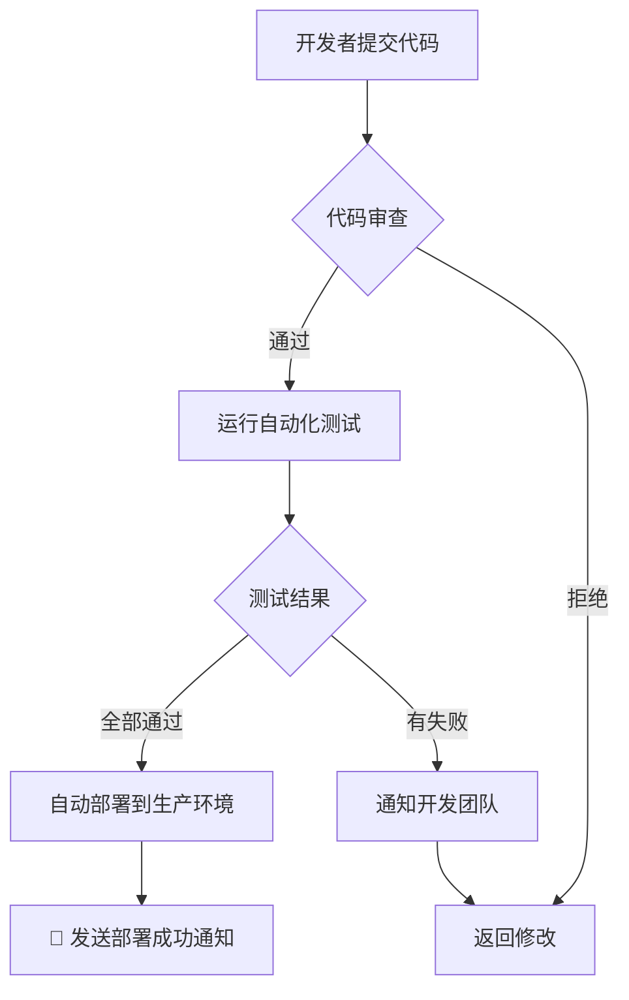

```mermaid
flowchart TD
    A[开发者提交代码] --> B{代码审查}
    B -->|通过| C[运行自动化测试]
    B -->|拒绝| D[返回修改]
    C --> E{测试结果}
    E -->|全部通过| F[自动部署到生产环境]
    E -->|有失败| G[通知开发团队]
    F --> H[📧 发送部署成功通知]
    G --> D
```
